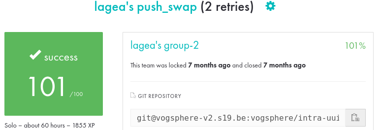
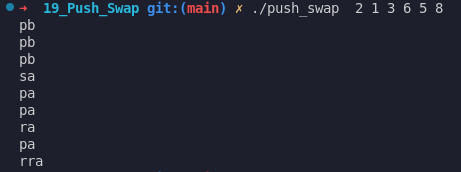

# push_swap

This repository contains my implementation of the **push_swap** project from [42](https://www.42.fr/). The goal of the project is to sort a list of integers using a specific set of operations on two stacks (commonly referred to as **stack A** and **stack B**). The challenge is to produce the sorted list with as few operations as possible.



Link to the subject: [Click here](docs/en.subject.pdf)

## Table of Contents

1. [About the Project](#about-the-project)  
2. [Project Structure](#project-structure)  
3. [Operations](#operations)  
4. [Algorithmic Approach](#algorithmic-approach)  
5. [Getting Started](#getting-started)  
6. [Usage](#usage)  

---

## About the Project

**push_swap** is a program that receives a list of integers as arguments, and outputs a sequence of instructions to sort them in ascending order. These instructions simulate stack operations on two stacks:  
- **Stack A**: Initially contains all the given integers.  
- **Stack B**: Initially empty.

### Objectives

- Practice algorithmic thinking to generate an efficient sequence of stack operations.  
- Develop an understanding of different sorting approaches and data structures.  
- Write clean, modular, and maintainable C code that adheres to **42**’s coding standards.

### Constraints

- You must use only the allowed set of operations (**sa**, **sb**, **ss**, **pa**, **pb**, **ra**, **rb**, **rr**, **rra**, **rrb**, **rrr**).  
- You cannot use any standard library function for sorting (e.g., `qsort`).  
- The number of moves (operations) must be as small as possible to pass the project’s evaluation criteria.

---

## Project Structure

- **inc/**  
  Contains all the header files with all necessary function prototypes, and data structures.

- **src/**  
  Contains source code files.

- **libft/**  
  Contains all the libft files, plus other projects usefull like [get_next_line](https://github.com/leoagea/19_gnl) and [ft_printf](https://github.com/leoagea/19_printf). 

- **Makefile**  
  Contains rules to compile the **push_swap** executable, all, clean, fclean re.

---

## Operations

The project only allows the following operations, each manipulating stack A or B:

| Code  | Instruction                         | Action                                                 |
| ----- | ----------------------------------- | ------------------------------------------------------ |
| `sa`  | swap a                              | swaps the 2 top elements of stack a                    |
| `sb`  | swap b                              | swaps the 2 top elements of stack b                    |
| `ss`  | swap a + swap b                     | both `sa` and `sb`                                     |
| `pa`  | push a                              | moves the top element of stack b at the top of stack a |
| `pb`  | push b                              | moves the top element of stack a at the top of stack b |
| `ra`  | rotate a                            | shifts all elements of stack a from bottom to top      |
| `rb`  | rotate b                            | shifts all elements of stack b from bottom to top      |
| `rr`  | rotate a + rotate b                 | both `ra` and `rb`                                     |
| `rra` | reverse rotate a                    | shifts all elements of stack a from top to bottom      |
| `rrb` | reverse rotate b                    | shifts all elements of stack b from top to bottom      |
| `rrr` | reverse rotate a + reverse rotate b | both `rra` and `rrb`           

---

## Algorithmic Approach


1. **Insertion Sort / Push-Swap**  
   - Push elements from **A** to **B**, then re-insert them in the correct order with cost-optimisation calculation to reduce the numbers of operations.   

2. **Optimized Small Stack Cases**  
   - Hard-coded minimal moves for **3**, **4**, **5**.  


---

## Getting Started

### Prerequisites

- A C compiler (e.g., **GCC** or **Clang**).  
- The `make` utility.

### Installation

1. **Clone the repository**:
   ```bash
   git clone https://github.com/leoagea/19_Push_Swap.git
   ```

2. **Cd in the repository**
   ```bash
   cd push_swap
   ```

3. **Compile the executable**
   ```bash
   make
   ```

---

## Usage

1. **To simply see all the operations done**
   ```bash
   ./push_swap  2 1 3 6 5 8 

   or 

   ./push_swap  "2 1 3 6 5 8" 
   ```

   It will output this : 

   

2. **To check if the stack is sorted**

   Use correct checker depends of your OS
   ```bash
   ./push_swap  2 1 3 6 5 8 | ./checker_Linux 2 1 3 6 5 8

   or

   ARG="2 1 3 6 5 8"; ./push_swap $ARG | ./checker_Linux $ARG
   ```

3. **To check the numbers of operations**

   ```bash
   ./push_swap  2 1 3 6 5 8 | wc -l

   or

   ARG="2 1 3 6 5 8"; ./push_swap $ARG | wc -l
   ```

4. **To generate and check for a random generated list of numbers**

   For a list of 500 numbers between 1 and 1000.
   ```bash
   ARG=$(shuf -i 1-1000 -n 500 | xargs) ; ./push_swap $ARG | ./checker_Linux $ARG ; ./push_swap $ARG | wc -l
   ```